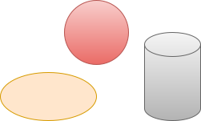
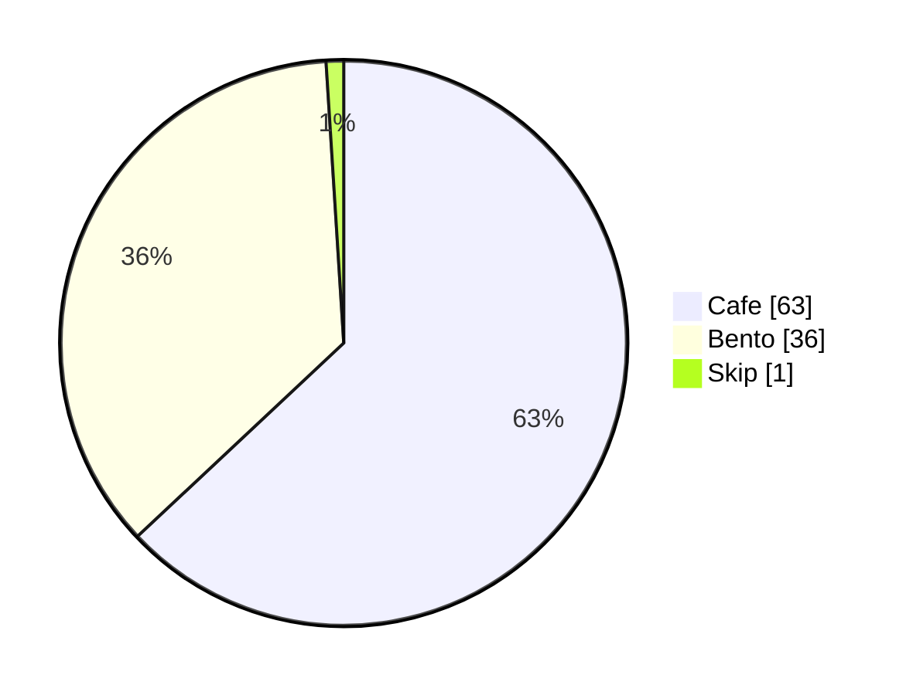

# メモ <!-- omit in toc -->
- [1. あさごはん](#1-あさごはん)
- [2. ひるごはん](#2-ひるごはん)
- [3. よるごはん](#3-よるごはん)
  - [3.1. 前菜](#31-前菜)
  - [3.2. スープ](#32-スープ)
  - [3.3. 魚料理](#33-魚料理)
  - [3.4. 肉料理](#34-肉料理)
  - [3.5. デザート](#35-デザート)

## 1. あさごはん

## 2. ひるごはん

## 3. よるごはん

### 3.1. 前菜

### 3.2. スープ

### 3.3. 魚料理

### 3.4. 肉料理

### 3.5. デザート

